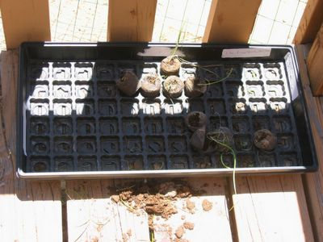

Nach acht Wochen sorgfältiger Pflege wurden meine Zwiebel- und Rosenkohlkeimlinge von einem wilden Tier zerstört. Die Nachbarn meinten es könnten Erdhörnchen gewesen sein, aber ich habe auch schon Kaninchen gesichtet. Eine Woche lang hatte ich die jungen Pflanzen im Schatten in der Veranda für die große Welt abgehärtet, als sie nur einen Tag vor der Umpflanzung am hellichten Tage ermordet wurden.

Was soll's, da muß ich eben alles ohne Vorsprung aussähen.
