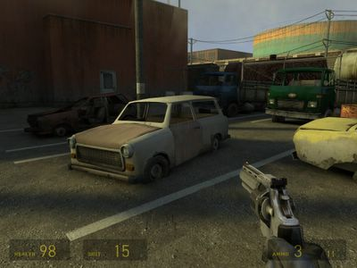
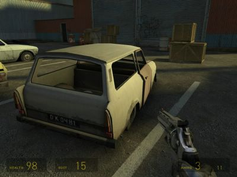

Obwohl die [Trabantwerke in Zwickau](http://de.wikipedia.org/wiki/Sachsenring_AG) schon lange tot sind, haben die dort hergestellten Fahrzeuge bis in die ferne Zukunft einen hohen Gebrauchtwert. Ich habe mehrere [Trabant](http://de.wikipedia.org/wiki/Trabant_%28Pkw%29)en in City 17 sowie auf dem Weg nach Nova Prospekt im futuristischen Endzeitspiel [Half-Life 2](http://hl2.vu-games.com/de/index.php) gesichtet.

Nach den Nummernschildern her gehören sie wohl alle russischen Besitzern. Ich hab' kein D oder P gesehen. ;)

[Wartburg](http://de.wikipedia.org/wiki/Wartburg_%28PKW%29), [Barkas](http://de.wikipedia.org/wiki/Barkas) oder ähnliches, ist bisher nicht aufgetaucht, aber einen dem [W-50](http://de.wikipedia.org/wiki/W50_%28LKW%29) sehr ähnlichem LKW läuft man ab und zu über dem Weg. Alles gute Ware aus ostdeutschen Landen, nix mit Westautos in der Zukunft! Ha!
