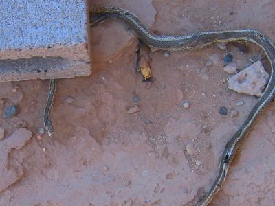

Dieser Betonblock ist zwar meiner, ich benutze ihn um die Plane auf dem Feuerholz zu befestigen, aber wie der nun auf die Schlange fiel weiss ich nicht. Andere (lebende) Schlangen habe ich hier noch nicht gesichtet. Auch ist jede Erwähnung von Schlangen unhöflich, da Indianer diese als Unglücksbringer ansehen.

Soweit ich das laienhaft einschätzen kann, ist dies eine [Gestreifte Peitschennatter](http://de.wikipedia.org/wiki/Gestreifte_Peitschennatter) und für Menschen ganz und gar ungiftig, schade. Sie sollen sehr flink sein, aber wohl nicht für einen fallenden Stein. Weiss noch nicht was ich mit ihr mache...
