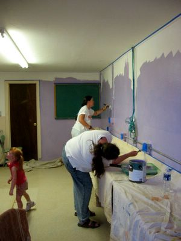

Heute malerten wir den Computerraum der Schule, welcher auf dem Gelände der Mission ist. Mit sechs Leuten ging es ganz gut und wir hatten den Raum am Nachmittag fertig.

Aber es war heiß!

Die kleine Fensterklimaanlage kam mit dem Kühlen nicht hinterher, aber ein Glück kühlt es hier abends ziemlich schnell ab, da wir etwa in 1400 Meter Höhe sind.

Den Rest des Tages verbrachten wir also mit anderen lebenswichtigen Dingen wie vor der Klimaanlage sitzen... oder [bloggen](http://www.wilwheaton.net/)...
