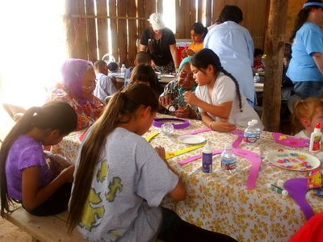
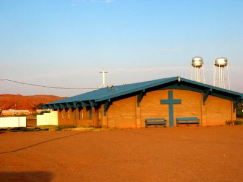

Wir Lutheraner waren natürlich durchorganisiert und bereit die Ferienbibelschule um Punkt 9:30 anzufangen, als wir mitbekamen, daß wir in der Navajo Zeitzone sind, das heißt, alle Zeiten sind grobe Vorschläge und könnten je nach Umständen alles mögliche bedeuten. Also hieß es stattdessen malern am Morgen, und die FBS war irgendwann am Nachmittag. :-)

Der Büroraum den wir malerten war etwa ein Drittel des Computerraumes von gestern, aber wir brauchten doppelt soviel Farbe und Zeit. Diese Betonziegelmauer hat ewig gedauert und die glatten Wände brauchten zwei Anstriche. Wir machen es morgen fertig.

Glücklicherweise konnten wir wieder jemandes "Schattenhaus" (im Prinzip eine winddurchlässige Holzhütte) für die FBS benutzen. Teilnahme war mehr als ausreichend und jeder hatte Spaß an Lorris Puppenschau, singen und basteln. Ich hatte meine Kamera vergessen und mußte ein Bild von Lorris kopieren.

Abends hatten wir einen Sandsturm der Ellens Fliegenschutztür abriß, aber kein Regen. Das muß wohl der Grund sein warum es hier keine hohen Bäume gibt.

