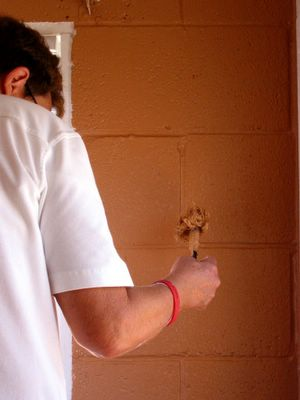
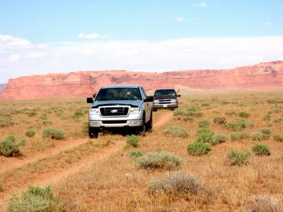
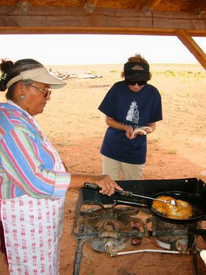

Dieser Pinsel wird benutzt um die vielen kleinen Löcher in den Betonblöcken zu füllen:

Bahnbrechend von Linda eingesetzt wird dieser spezialisierte Pinsel in einem kreisförmigen Streichverfahren verwendet und funktioniert viel besser als ein Farbroller.

Am Nachmittag ging es zu Normas neuer Ansiedlung auf einem Hügel der von atemberaubenden Felsformationen umgeben war. Dort wurde uns Weißhäuten dann gezeigt wie man Navajo Fry Bread (Navajo-Bratbrot?) macht.

Der Teig wurde zuvor in der Missionsküche von Norma vorbereitet. Sie nahm ein paar handvoll Mehl und Backpulver, eine Prise Salz und etwas Trockenmilch und handknetete den Teig bis er wie feuchter Pizza Teig aussah. Als ich sie auf ein genaues Rezept festnageln wollte, meinte sie nur: "Och, na soviel bis es sich richtig anfühlt..."

Wenn ich es erfolgreich zu Hause wiederholen kann, schreibe ich mal eine Rezeptanleitung.

Jeder lachte sich kugelig (vielmehr teigkugelig) \[och, Wortspiele übersetzten ist eine undankbare Aufgabe\] während man versuchte ein flaches rundes Brot zu formen. Dieser Abschnitt wird liebevoll "Geographiestunde" genannt, weil es Spaß macht die verschiedenen US-Staatenformen (ein wichtiger Teil amerikanischer Schulbildung) zu erraten, die die Teilnehmer erhalten wenn sie versuchen das Brot rund zu machen. Nachdem sich jeder mit seinem krummen Fladen abgefunden hatte, wurde das Brot zu Norma gegeben oder mutig in die Pfanne gelegt und dann professionell von ihr gebraten.

Dann wurde das Rinderhack, Käse und frisches Gemüse aufgehäuft, damit es ein Navajo Taco wurde. Von Staatenformen mal abgesehen, schmeckte es zusammen mit dem Aroma der Umgebung und dem "Salz der Erde"-Gesellschaft von Christusfreunden fantastisch.

