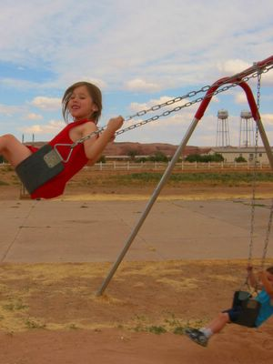
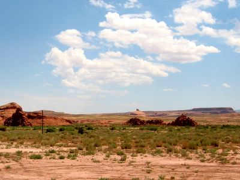
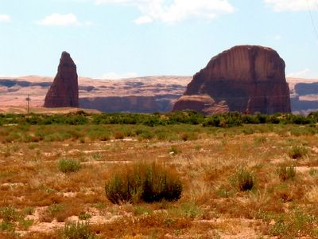
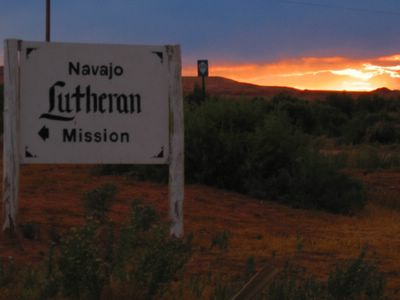

On the last day we were supposed to finish up the last office room, but it was locked and the lady with the key was out and about. Luckily, the actual painting was as good as done and putting back the furniture was all that remained.

Am letzten Tag sollten wir eigentlich den letzten Büroraum fertig machen, aber es war abgeschloßen und die Dame mit dem Schlüßel war unterwegs. Ein Glück war der Anstrich so gut wie fertig und nur das Einräumen der Möbel blieb übrig. So haben wir uns vor der Abreise eben anderweitig beschäftigt...

At our spaghetti good bye dinner we made the aquaintance of Kai from Pennsylvania, who was on his way to California to serve in the armed forces and stayed at the mission for the night. He was thrilled to meet another Kai, and we exchanged various misspellings and mispronunciations that name inevitably has to suffer.

Während wir unsere Abschiedsspaghetti aßen, machten wir die Bekanntschaft mit Kai aus Pennsylvanien, welcher auf dem Weg nach Kalifornien war um in der Armee zu dienen und in der Mission für eine Nacht übernachtete. Er war erfreut einen anderen Kai zu treffen und wir tauschten diverse Namensversprecher und -verschreiber aus, die man hier mit diesem Namen unvermeidbar erleiden muß.

Nachdem wir Abschied genommen hatten, fuhren wir durch die schöne Landschaft nach Hause, die Gedanken bei unseren neuen Freunden in der [Navajo Evangelical Lutheran Mission](http://www.nelm.org/).

"Auf Wiedersehen, Walfischberg!"

"Good bye Whale Rock!"

THE END

THE END
