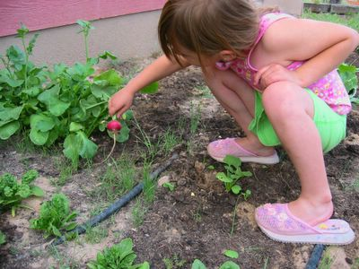

Die Radischen sind fertig!

Muttern musste mich erst mal über diese langen hohen Radischenpflanzen aufklären, von denen man im obigen Bild zwei sehen kann. Dies sind Samenerzeuger und hätte ich sie nicht mit den anderen herausgerissen, hätte ich kostenlose Samen für nächstes Jahr gehabt! Auch hat sie mir vorgeschlagen den Tropfschlauch entlang der Reihen und nicht quer zu legen. So hätte ich diese Lücken vermeiden können. Also wie ihr seht, muß ich noch einige Tricks lernen.

Trotzdem hab ich mich mal von Amy als stolzer Heimgärtner ablichten lassen:

Im Hintergrund kann man die blühenden (trotz Umpflanzung!) Lilien und Stockrose sehen. Das Unkraut hatte natürlich eine wochenlange Party... Weiß nicht ob ich das vor unserer langen Reise am Sonntag noch unter Kontrolle bekomme.
