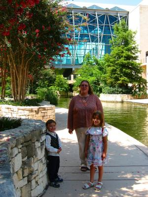
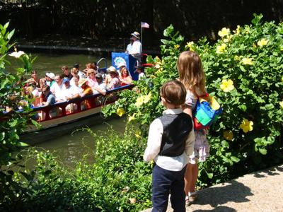
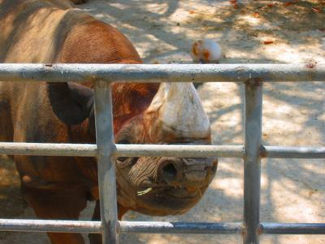

... das es so lange gedauert hat, bis ihr mal wieder was von mir hört.

Während unseres Aufenthaltes in San Antonio hat sich das Hotel wirklich affig benommen. Die hatten nur kabelloses Internet, und da ich Brenda's Rechner nicht mit Wireless Network ausgestattet hatte, musste ich deren Wireless-Adapter ausleihen. Den durfte man aber nur für zwei Stunden behalten, sonst gibt es eine Strafgebühr. Diesen Unsinn habe ich natürlich nur einmal mit gemacht.
Um dem Tannenbaum noch einen Zapfen anzuhängen, haben die uns bei der Abreise beschuldigt diesen blöden Adapter (der sowieso nur in ihrem dusseligen Hotel funktioniert!) verbummelt oder sogar eingepackt zu haben und wollten jetzt $400 Erstattungsgebühr. Wir waren vielleicht sauer... Ein Glück habe ich meine liebes Weib, Amy; die hat die eine Weile vollgemeckert und dann haben sie uns nach eine halben Stunde schon gehen lassen.
Wer dieses, für amerikanische Verhältnisse, unfreundliche und unprofessionelle Hotel gerne vermeiden möchte, wenn man das nächste Mal in San Antonio, Texas urlaubt:

> [Woodfield Suites](http://www.woodfieldsuites.com/lq/properties/propertyProfile.do?ident=LQ7003&returns=&promocorp=)
> [100 West Durango Boulevard](http://www.google.com/maps?q=Woodfield+Suites&spn=0.013423,0.020262&near=San+Antonio&cid=29423889,-98493333,9546772441206284860&num=10&start=0&hl=en)
> [San Antonio](http://www.sanantoniocvb.com/), [Texas](http://www.traveltex.com/) [78204](http://www.zip-codes.com/zips/78204/default.asp)
> [USA](http://www.cia.gov/cia/publications/factbook/geos/us.html)

> [Woodfield Suites](http://www.woodfieldsuites.com/lq/properties/propertyProfile.do?ident=LQ7003&returns=&promocorp=)
> [100 West Durango Boulevard](http://www.google.com/maps?q=Woodfield+Suites&spn=0.013423,0.020262&near=San+Antonio&cid=29423889,-98493333,9546772441206284860&num=10&start=0&hl=en)
> [San Antonio](http://www.sanantoniocvb.com/), [Texas](http://www.traveltex.com/) [78204](http://www.zip-codes.com/zips/78204/default.asp)
> [USA](http://www.cia.gov/cia/publications/factbook/geos/us.html)

Der Rest des Aufenthaltes in San Antonio war aber trotzdem schön (und heiß)! Siehe Photos:

Hier spazieren wir auf dem [River Walk](http://www.usa.de/ReiseZiele/Staaten/Texas/Attraktionen/index-b-767-293.html) (Flußpromenade). Im Hintergrund kann man das Convention Center sehen, wo Amy ihre [Women of ELCA](http://www.womenoftheelca.org/)\-konferenz hatte.

Die Bootstour war für uns Touris natürlich obligatorisch. [Hier](http://hotx.com/rb/rbtour-j/as00.html) ist eine Virtuelle Tour, falls ihr in Sightseeing-Laune seit.

Während Amy mit den Frauen der ELCA conferierte, besuchten die Kids und ich die Lokalattraktionen, wie [Sea World](http://www.seaworld.com/seaworld/tx/att_ge.aspx)...

...mit den Seegurken...

...with its Sea cucumbers...

... und Delphinen, ...

... and Dolphins, ...

... und der San Antonio Zoo mit Kängerus, ...

... und Alligatoren, ...

... and alligators, ...

... Naßhörner ...

... Rhinos ...

... und Giraffen.

... and giraffes.

Oder anders gesagt, wir hatten Spaß gehabt.
