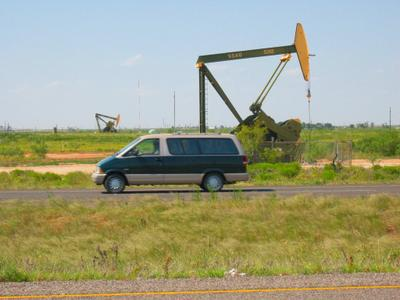

Je näher wir der texanischen Bundesgrenze kamen, desto mehr Erdölpumpen (oder auch Tiefpumpen) wippten am Straßenrand auf und ab. Das Resultat wurde an der nächsten Tanke deutlich. Mit einem Benzinpreis von 0.43 Euro statt den bisherigen 0.49 Euro konnten wir ungefähr 6 Eurocents pro Liter sparen! Ich dachte immer, daß der größte Anteil des Rohöls von den USA importiert wird, aber es gibt wohl doch noch sowas wie einen lokalen Markt.

The closer wie got to the Texan state border, the more oil wells (or actually oil rigs) were see-sawing up and down next to the road. The result became clear at the next gas station. With prices at $1.98 instead of the $2.30 so far, we saved about 32 cents per Gallon! I always thought, that virtually all crude oil was imported by the US, but apparently there still is such a thing as a local market.
