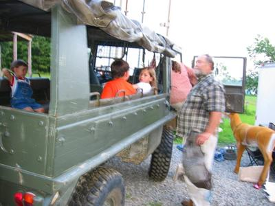

Before I start, I just want to mention the outstanding service we've received in Arkansas. We spend the night at the Best Western in Hope, AR, birthplace of Bill Clinton, and it was almost a shocking friendliness compared to the Woodfield Suites in San Antonio. Naturally, there was a Western Sizzlin across the parking lot, where we ate a great steak dinner and received our second shock. When paying, I forgot the discount that the concierge of the Best Western had mentioned earlier. I only remembered it, after the cashier had printed the receipt already. The manager had overheard my mumbling, stepped up to the register, pushed some buttons and gave me back the discount percentage in cash. How's that for service? I am not asking the battle-hardened Europeans here, I am asking you, the spoiled Americans! I was blown away. Good job Hope, AR!

Bevor ich anfange, muß ich schnell noch den hervorragenden Kundenservice den wir in Arkansas erhalten haben erwähnen. Wir übernachteten im Best Western in Hope, Arkansas, der Geburtsort von Bill Clinton, und die Freundlichkeit war, verglichen mit den Woodfield Suites in San Antonio, fast schockierend. Logischerweise gab es gleich über dem Parkplatz ein Western Sizzlin (gutes Steakrestaurant), wo wir ein großartiges Steakdinner aßen und einen zweiten Schock erhielten. Als ich an der Kasse bezahlte, vergaß ich den Rabatt, den der Concierge des Best Western Hotels erwähnt hatte. Bevor ich mich endlich erinnerte, hatte der Kassierer die Rechnung schon ausgedruckt. Der Manager überhörte mein Nuscheln, kam zur Kasse, drückte ein paar Tasten und gab mir den Rabattanteil als Bargeld zurück. Ist das ein Kundenservice, oder was? Ich, als abgehärteter Kunde aus Deutschland, konnte es kaum fassen. Gut gemacht Hope, Arkansas!

Wir kamen ohne Probleme bei Amy's Eltern an, daß heißt, wir sind nicht wie üblich am Pfad in den dunklen Wald, der zu Hogs Hollow (Schweinesenke) führt, vorbeigefahren. Sie haben sich diesen seltsamen Namen aus geschäftlichen Gründen ausgesucht, denke ich mal, da sie planen ein Jagdunternehmen in der Coen Lodge zu führen. In etwa wie ein Bed & Breakfast (Zimmer mit Frühstück), aber mit Gewehren, Tarnung und einer Rehhälfte zum Abendessen. Selbstkritischer Humor ist ja schön und gut, aber ich war doch etwas wegen der Konnotationen mit Schweinen besorgt, bis ich an ein englisches Sprichwort erinnert wurde: “Selbst ein blindes Schwein findet mal eine Eichel.”

Die Jagdhütte schreitet gut voran und ist bewohnbar und eigentlich sehr gemütlich. Dieses verschwommene Photo ist das einzige, das ich von unserem ganzen Aufenthalt habe. Jeder steigt gerade in den Pinzgauer zur obligatorischer Tour des Gutsbesitzes ein, die von unserem Lokalführer und Landverwalter Dan angeführt wird.

