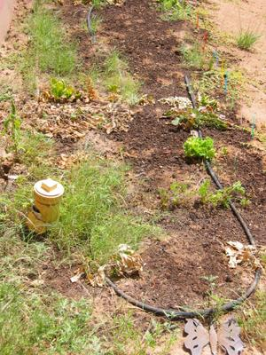

Das ist das Ende meines schönen Gartens! Ich hatte extra deutliche Anweisungen für unsere Hundefütterin hinterlassen und trotzdem hat sie den Wasserhahn, und damit den automatischen Wassertimer für den Garten zu gedreht. Die Pflanzen brühten für mindestens eine Woche in der Sommerhitze (bis zu 40 Grad).
Das lokale Gras und die Unkräuter gedeihten natürlich prächtig! Gibt's eben Grassuppe...

Nicht alles wurde vernichtet, ein kleiner Salat hat sich gerettet, indem er das stehende Wasser aus dem Tropfschlauch lutschte, drei oder vier Karrotten wollen auch nicht so einfach verotten und ein paar Schnittlauchfransen wachsen wacker weiter.

Also dann, bis zur nächsten Gartensaison, Euer demotivierter Hochwüstengärtner.
