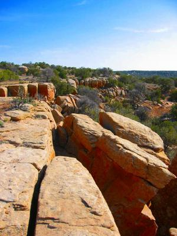
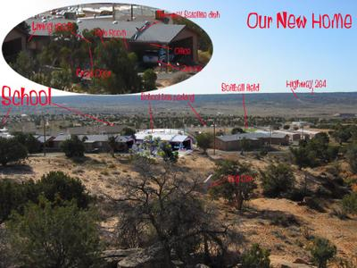

Nördlich von unserem Haus liegt dieses felsige Kliff, wo ich ab und zu sitze und über die Welt nachdenke. Abgesehen vom gelegentlichen Schulbus oder einem seltenem Flugzeug, ist das lauteste Geräusch das man dort oben hören kann der Wind. Je nach Wetter ist es ein stilles Säuseln durch den Wacholder oder ein langatmiges Pfeifen durch die Ritzen der erodierenden Sandsteinbrocken.

Des Nachts kann man die volle Pracht des Firmaments bestaunen. Die Milchstrasse hatte ich seit Jahren nicht so brilliant gesehen. Die paar Straßenlaternen Jedditos kann man mit der Lichtverschmutzung (wie man das hier nennt) der Großstädte gar nicht vergleichen. Von da oben machen sie sich kaum bemerkbar und etwas weiter vom Abhang entfernt steht man in völliger Dunkelheit.

Das Bild am Tage (zum Vergrößern draufklicken) habe ich für euch zur Orientierung beschriftet:

Die bi-direktionelle Satellitenantenne ist was ich gerade benutze um mit euch zu kommunizieren. Die Telefonleitung ist grottenschlecht und Kabel gibts hier nicht. Der [Highway 264](http://mq-mapgend.websys.aol.com/?e=9&GetMapDirect=Gme5diw%2cb%3a9u12%3b%40%24xd%2dtg0w72%26%3d2nu%2d205y72%26ub%261azn9u%24nu%2d7w00al%26a7guu%24n9r7%7c1%4022u6%2a%3al6tl%26%40%24%3a%26a8%260zrlu6%24%2e9u7%269az2u6%24%3a%26u72u%2c%24xuzb%3a%26%40%24%3al4%40g9082u%40%5fn96%40nhwa2u%40%24%3a94tw%3bu%24ndz7%261%2cbs5r%24%3a%26uz2%26uz20r8xq%40200%40%24ndw7%261%2czn%26w%24xdzt5u%40%5fn962xdf%24%2eq%40%5fa%26%3d2%3a%29a%242%26%3db%3a%29z%242%26%3dr%3au%40%5fl%26%3d2%3a%290%24%2e9%40%5f5%26%3db%3a%29w%24%2e1%40%5fl%26%3d2%3a%29u2%3a%29w%24%2ed%40%5fl%26%3dax%26%3d2x%26%3d2l%26%3d22%26%3d22%26%3d22%26%3d2l%26%3d2g%26%3db%3a%29u7%3a%29w%24%2e1u%24%2eg%40%5fn9%40%5f5%26%3dr%3ad%40%5fa%2601%3a%29wr%3a0%40%5fg%26u7%3a%29f%24n9%40%5fg%26u8%3a%29u7%3aq%40%5f5%26wz%3a%294t%3a1%40%5f5%26u%242%26a%24%2el%402%3a%29a%24lu%40%5flq%40a5u%40%5fxuy%24nq%40%5fn0%40b%3a%29a%24a%26%3d8%3aq%40%5fl%26r%24%2e1%40r%3a%29u%24ng%402%3aq%40%5fn%26z%24%2eq%40r%3a%29w%240%266%24l5%40%5fx%26a%24%2e9%40a%3au%40a%3a9%402%3a1%407%3a9%40%5fx%26ua%3a%290%24nu%407%3aq%402%3a90%24n%26a%24n%26r%24l%26u2%3au%408%3au%402%3a9482%3b6%24nq67%261%2c%24006b%3a%26) ist unsere Verbindungsader zur Außenwelt (Post holen, einkaufen, tanken, etc.) und die Hundehöhle (Dog Den) ist die gleiche, von der ich [vorher schon](/de/blog/2005-04-21-more-puppies/) einmal schrieb.

The two-way satellite dish is what I am using right now to communicate with you. The phone line is al-grotto and there is no cable here. [Highway 264](http://mq-mapgend.websys.aol.com/?e=9&GetMapDirect=Gme5diw%2cb%3a9u12%3b%40%24xd%2dtg0w72%26%3d2nu%2d205y72%26ub%261azn9u%24nu%2d7w00al%26a7guu%24n9r7%7c1%4022u6%2a%3al6tl%26%40%24%3a%26a8%260zrlu6%24%2e9u7%269az2u6%24%3a%26u72u%2c%24xuzb%3a%26%40%24%3al4%40g9082u%40%5fn96%40nhwa2u%40%24%3a94tw%3bu%24ndz7%261%2cbs5r%24%3a%26uz2%26uz20r8xq%40200%40%24ndw7%261%2czn%26w%24xdzt5u%40%5fn962xdf%24%2eq%40%5fa%26%3d2%3a%29a%242%26%3db%3a%29z%242%26%3dr%3au%40%5fl%26%3d2%3a%290%24%2e9%40%5f5%26%3db%3a%29w%24%2e1%40%5fl%26%3d2%3a%29u2%3a%29w%24%2ed%40%5fl%26%3dax%26%3d2x%26%3d2l%26%3d22%26%3d22%26%3d22%26%3d2l%26%3d2g%26%3db%3a%29u7%3a%29w%24%2e1u%24%2eg%40%5fn9%40%5f5%26%3dr%3ad%40%5fa%2601%3a%29wr%3a0%40%5fg%26u7%3a%29f%24n9%40%5fg%26u8%3a%29u7%3aq%40%5f5%26wz%3a%294t%3a1%40%5f5%26u%242%26a%24%2el%402%3a%29a%24lu%40%5flq%40a5u%40%5fxuy%24nq%40%5fn0%40b%3a%29a%24a%26%3d8%3aq%40%5fl%26r%24%2e1%40r%3a%29u%24ng%402%3aq%40%5fn%26z%24%2eq%40r%3a%29w%240%266%24l5%40%5fx%26a%24%2e9%40a%3au%40a%3a9%402%3a1%407%3a9%40%5fx%26ua%3a%290%24nu%407%3aq%402%3a90%24n%26a%24n%26r%24l%26u2%3au%408%3au%402%3a9482%3b6%24nq67%261%2c%24006b%3a%26) is our sole connection to the outside world (getting the mail, gas, shopping, etc.) and the dog den is the same I [wrote about](/de/blog/2005-04-21-more-puppies/) earlier.

Es gibt noch ein paar Mehrfamilienhäuser zur Linken die zusammen mit dem Schulgelände und dem Stammeshaus (eine Art Rathaus für die Niederlassungen der Navajos) den Ort von Jeddito ausmachen. Gleich hinter unserem Haus, oder auf der anderen Seite der Hauptstraße weiter unten, fängt die Wildernis an.
