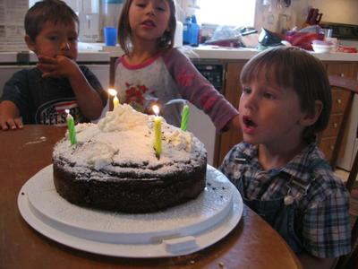
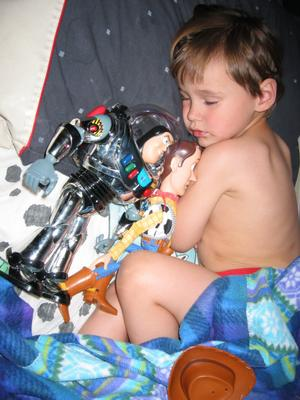

Hier sind ein paar Bilder von Kais kleiner Geburtstagsfeier. Der Junge links ist Kais bester Freund, James, und ist unser Nachbar. Kai hatte sich einen Schokoladenkuchen gewünscht. Der Mix hatte ein Glück eine Backanleitung für Höhenregionen.

Kai hat sich über die Transformerversionen von Buzz (transformiert sich in ein Raumschiff) und Zurg (transformiert sich in einen Panzer) sehr gefreut, auch wenn er hier gerade eine Flunsch zieht. Er schaut sich Toy Story 2 nahezu religiös an, nun kann er es nachspielen.

Noch viel mehr hat er sich über Woody und Buzz in Originalgröße gefreut. Komplett mit Hut, Gitarre und Sprachfunktion. (Leider sagt Woody nicht das berühmte "Da ist eine Schlange in meinem Schuh.") Buzz hat seinen Laser, Kommunikator und einenEnergiescheiben schießenden Rucksackdingens. Na ihr könnt sicher leicht erkennen, wer ihm diese Spielzeuge teuer auf eBay ergattert hat... ;)

Danach ging es dann noch zum "Familienleseabend" in der Schule, wo Kirin und Kai bastelten, lasen und Preise gewannen. Wieder zu Hause, wollte Kai natürlich seine neuen Freunde gleich mit ins Bett nehmen, auch wenn sie nicht gerade die kuscheligsten Spielzeuge sind. Vom Schlaf haben sie ihm aber nicht abgehalten. Schöne Träume, mein Großer.
