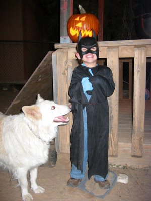

Haben das erste Halloween im neuen Haus gut überstanden, da wir frühzeitig über den Andrang von verkleideten Navajokids gewarnt wurden. Es war am Ende aber gleichwertig mit Halloween in Mesa, wo Kinder aus den umliegenden Ländereien auch per Kleinbus und Truck angekarrt wurden. Der einzige Unterschied in Jeddito war, daß die Hälfte der Trick-Or-Treaters uns mit Namen ansprachen...

We survived the first Halloween in our new Home, as we were warned beforehand about the rush of costumed Navajo kids. In the end, it was about equal to Halloween in Mesa, where kids from the surrounding rural areas are also carted over by the van and truck load. The only difference in Jeddito was that half of the trick-or-treaters adressed us by our name...

Kai ist natürlich mit Batmankostüm ins Bett gestiegen, hat sich aber irgendwann in der Nacht gegen die Maske entschieden.

Zur allgemeinen Geisterlaune, ein passendes [Spielchen](http://dedge.com/flash/hangman/).

Didgy war ganz außer sich wegen der Kinderhorden, die nun ausgerechnet auch noch in ihrem Garten rumlaufen mussten.

Kirin, die passend als Prinzessin verkleidet war, hatte viel Spaß beim Kürbisdesign (oben im Bild) und war zu sehr mit ihrer süßen Beute beschäftigt um auch noch für Papas Photo zu posieren. Den Kürbis hab ich ausgehöhlt, und dabei die Kerne und das gute Fruchtfleisch von den Matschfäden separiert. Die Kerne wurden mit Butter und etwas Salz im Ofen geröstet und das Fruchtfleisch wird demnächst zum traditionellen und allseits beliebten Pumpkin Pie (eine Art Kürbistorte) verarbeitet.

Kirin, who was fittingly dressed up as princèss, had lots of fun with designing the Jack'O'Lantern (top of picture) and was too busy with her sweet loot and plunder to also pose for Daddy's picture. When I emptied the pumkin, I carefully seperated the seeds and good pulp from the slime strings. The seeds were oven roasted with butter and some salt, the pulp will soon be made into the traditional and beloved pumpkin pie.

Wie sieht es denn in Deutschland mit Halloween aus? Wurde das dort auch schon einamerikanisiert? Bitte um Kommentar!
