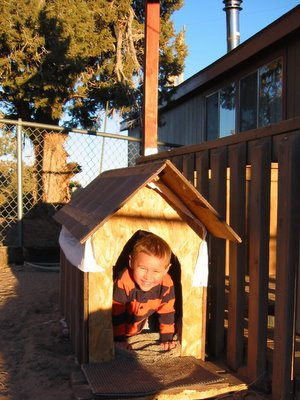

Didgy hatte zwar den letzten Winter ohne Hundehaus gut überstanden, aber trotzdem tut sie mir auf unserer Veranda während der bitterkalten Hochwüstennächte leid. Also hab ich ihr aus einem rumliegenden Stück Sperrholz ein Häusle gezimmert. Der Eingang ist etwas schief, aber ich habe (noch) keine Holzfeile und musste das mit der Kreissäge in der Hand irgendwie hinkriegen. Die mit Duschvorhangresten behangenen Oberlichter sind auch nicht so toll, aber ansonsten bin ich ganz zufrieden mit meiner Baukunst. Ein noch zu folgender Anstrich sollte dem Anblick weiter verbessern und die Ritzen gut abdichten.

Leider scheint die Hütte den Kindern besser zu gefallen als dem Hund. Ich hab Didgy einmal dabei erwischt, als sie rauskam, aber ansonsten spielen eher die anderen bellenden und krabbelnden "Hunde" darin.
