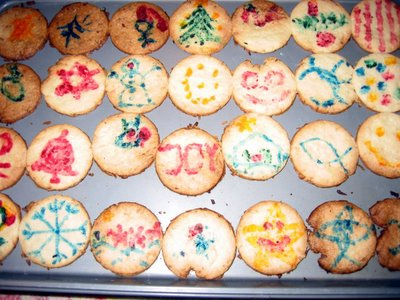
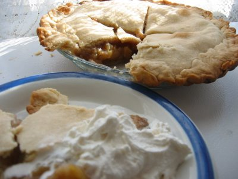

Bin zur Zeit mit meinem [Nebenberuf](http://guidoschlabitz.language123.com/) beschäftigt und habe seit Tagen Texte für eine [Sicherheitsfirma](http://www.hitecsecurity.de/) geschrieben und übersetzt. Das geht auch noch bis ins nächste Jahr weiter, aber ich werde versuchen das Blog nicht zu sehr zu vernachlässigen...

In der Zeit in der ich nicht vorm Computer saß, habe ich mich mal an etwas Weihnachtsgebäck gewagt. Vielen Dank für das deutsche Weihnachtsbackbuch, Mutti! Die Butterkekse sind echt lecker, aber ich hab wohl was bei der Umrechnung zu Fahrenheit falsch gemacht; tF = tC+32\*5/9 oder ist es 9/5?? Jedenfalls sind ein paar etwas angebrannt. Kirin half mit dem Ausstechen und dem Bemalen, aber ich hatte auch viel Spaß mit den Lebensmittelfarben.

Demnächst wage ich mich dann mal an einen Christstollen (ich hatte keine Ahnung, daß dieser das [eingewickelte Christkind](http://de.wikipedia.org/wiki/Christstollen) darstellt!), obwohl wir diesen hier, oh Wunder aller Wunder, in einem Safeway als Deutschlandimport käuflich erwerben konnten! Der Puderzucker (wenn es welcher war) war ekelig, aber den Rest hab ich in drei Tagen weggeputzt.

Next, I am going to test my skills on a German speciality called "Christstollen". Here is [what Wikipedia has to say about it](http://en.wikipedia.org/wiki/Christstollen), I never knew exactly why it was named Stollen, and that it represents the Christ child in swaddles, together with other baked Christian symbols during Advent season, like the pretzel. We did, however and with amazement, discover a Stollen as a German import at Safeway, ready for the buying! The icing was all wrong, but the rest was gone in three days.

Mit dem Apple Pie, welcher gemäß Betty Crocker (ein weit verbreitetes Kochbuch) eines der 10 beliebtesten Gerichte in Amerika ist, hatte ich mehr Glück, obwohl ich von Betty bei der Kruste etwas abgewichen bin und weniger Salz nahm und sie mit braunem Zucker versüßt hatte. Dann noch etwas Schlagobers statt dem üblichen Vanilleeis und das Schlemmern konnte beginnen. Hmmmmm....

