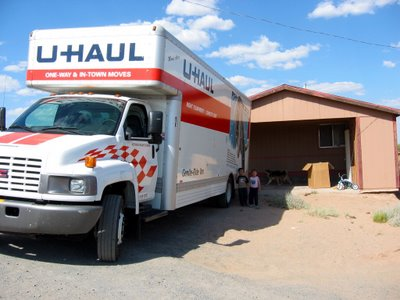

Leider konnten wir den LKW zum Umzug nicht wie versprochen in Holbrook abholen, aber U-Haul hatte einen in Show Low. Etwa 45 min weiter südlich, aber dafür haben wir einen Rabbat von 20% bekommen, was sich bei diesen Überlandumzügen richtig lohnt.
Dann ein milder Schock an der Tankstelle: Ich wollte den halben Tank schnell noch auffüllen und mußte am Ende $75 (59 EUR) für 24 Gallonen (91 l) zahlen. Das war ein halber Tank...

Hab den Truck so geparkt wie ich es wollte, damit das einladen besser geht. Die Kinder rannen die Rampe rauf und runter und hielten nur mal ein paar Sekunden still um diese beiden Photos zu schnappen.

Da unser Truck wohl aus New York ist, haben wir sogar echtes Graffiti drauf. 8-)

Zusatz, Dienstag, 6. Juni: Wir sind immer noch hier. Das Packen und Einladen dauert ewig, wie immer. Wir (oder sollten wir sagen Amy und Janet) hatten geplant am Dienstag Morgen los zu fahren, aber wie es aussieht, haben wir Glück, wenn wir mittags am Mittwoch losfahren...

