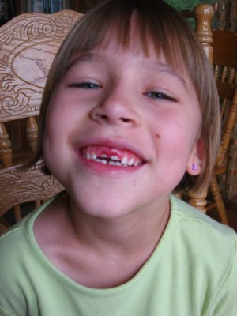

Kirins Vorderzähne hatten schon seit Weihnachten gewackelt, nun hatten Papa und Oma Janet genug und zogen sie (und ein gutes Stück Gaumen) unter viel Schreien und Treten des Patienten raus. Innerhalb von ein paar Minuten hatte Kirin sich beruhigt und war ganz froh, daß sie jetzt endlich raus sind. Wie im Bild rechts zu sehen wuchsen die neuen Zähne schon hinter den Milchzähnen ein.

Neben den neuen Zähnen haben wir uns auch neue Hüte im Agrarzubehörladen gekauft. Für mich sind typische Cowboysachen nicht nur Show, sondern erfüllen ihren Zweck, was ich heute beim Einsammeln der Heuballen schnell gelernt habe. Der neue Hut hat meinen Hals und das Gesicht vom Sonnenbrand bewahrt und meine langen Jeans (auch bei heißem Wetter) hielfen beim Klettern auf dem 5 m hoch gestapeltem Heuhaufen, aber ich brauche noch ein langärmliges Hemd um Kratzer an den Unterarmen zu vermeiden und Lederstiefel, die Käfer und Zecken daran hindern in die Hosen zu kriechen. Der Gürtel hält die Hosen da wo sie sein sollen und ein Halsband fängt den Schweiß auf. Im Handumdrehen trägt man eine komplette Cowboyuniform...
