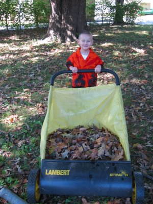

Hallo!? Liest hier noch jemand? 8-D

'Tschuldigung für die lange Pause, aber ich habe jetzt wieder weniger Freizeit. Wie einige von euch ja schon wissen, sind wir am 1. September nach langem hin und her endlich in unser neues Haus (Photo links, jaja, ich muss Laub harken...) in [Harrisburg, IL](http://maps.google.com/maps?hl=de&q=harrisburg,+il) eingezogen. Nicht nur das, ich habe auch endlich einen Job bei [Evolution Multimedia](http://www.evolutionmc.com/) gefunden und bin jetzt wieder von 8-5 Uhr auf Arbeit. Zur Zeit arbeite ich an der Partnerabteilung von [Stinky Fish Poker](http://www.stinkyfishpoker.net/), einer Online-Pokerseite. Das Spiel muss natürlich auch getestet werden, was hieß, das ich mal schnell Texas Holdem Poker für die Arbeit lernen musste. Die Webseite und das Spiel sind zur Zeit noch in Arbeit, aber bald könnt ihr euch mit mir übers Netz an einen virtuellen Pokertisch setzen.

Gleich nach der Arbeit geht es weiter mit Reparaturen am Haus. Es ist ein altes, um 1920 gebautes, zweistöckiges Haus mit hohen Zimmerdecken, knarrenden Stufen, seltsamen Lichtschaltern und ungefähr 232 Quadratmeter Charakter. Ich habe inzwischen praktischerweise gelernt wie man eine Stromleitung verlegt, Wasserhähne und Abflussrohre auswechselt, einen Eiswürfelmacher anschliesst, einen Gasherd installiert und zur Zeit versuche ich das Herbstlaub aus der Regenrinne zu halten. Die Rinne enthielt etwa 2-3 cm bester Komposterde, die das Ablaufen des Wassers erfolgreich verhinderte und uns einen luxoriösen Innenwasserfall im Keller bescherte.

Amy hilft fleissig beim Umzugskisten auspacken. Sie hatte zuerst in einer christlichen Privatschule gearbeitet, sich aber dann entschieden wieder zu Hause zu bleiben, da die Tagesstättenkosten für Kai fast genauso hoch waren wie ihr Einkommen. Weiterhin hat sie ihren Zertifikatstest für Illinois Lehrer mit Bravour bestanden, und hat vor sich in ein zwei Jahren, wenn Kai zur Schule geht, wieder als Grundstufenlehrerin zu bewerben.

Den Kindern gefällt Illinois auch gut. Sie besuchen die Coens fast jedes Wochenende, haben den lokalen Stadtpark zum Spielen entdeckt und helfen mir im Garten. Hier könnt ihr Kai beim Laubharken mit dem StingRay sehen. Dieses seltsame Gerät haben wir in einer Ecke im Keller gefunden und es funktioniert ganz gut. Eine rotierende Harke wirft das Laub in den Auffangbeutel, der dann per Hand entleert wird. Im Nu ist der ganze Garten geharkt, bis es in zwei Tagen wieder losgeht...

Jaja, der Herbst, ich hab ihn so vermisst. Wir haben zwei vielfarbige Ahornbäume und eine uralte Eiche die auf der Westseite unser Hausdach überragt. Dann noch zwei Judasbäume, ein paar Büsche und eine Hecke, also genügend Laub um uns bis Ende November zu beschäftigen.
