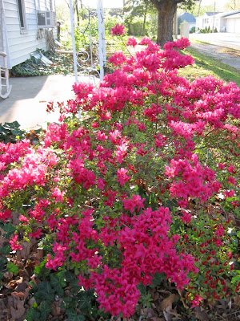
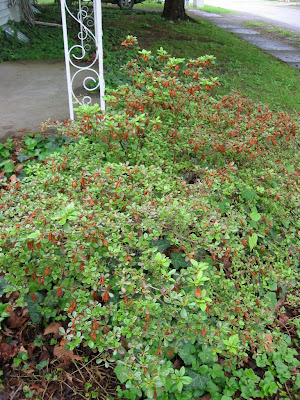
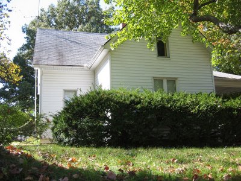
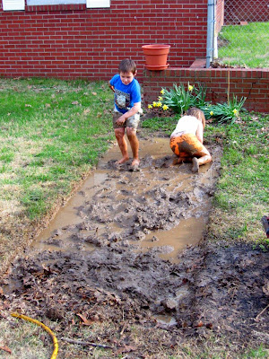

<table align="center"><tbody><tr><td>Vor den Eisheiligen... Before the spring freeze...</td><td style="width: 100px;"> </td><td>...nach den Eisheiligen. ...after the spring freeze.</td></tr></tbody></table>

Vor der Heckenschere...
Before the shears...

... nach der Heckenschere!
...after the shears!

(und dem Rasenmäher)

<table align="center"><tbody><tr><td>Vor dem Frühlingsregen... Before the spring rain...</td><td style="width: 100px;"> </td><td>...nach dem Frühlingsregen. ...after the spring rain.</td></tr></tbody></table>

Die Radieschen, ganz hinten, sprießen natürlich wie die Wilden. In der Mitte kommen Warzen- und Honigmelonen hoch. Die Honigmelonensamen habe ich aus einer Ladenmelone hochwissenschaftlich extrahiert (mal sehen was am Ende rauskommt). Im Vordergrund sind zwei Tomaten, die mir die Coens freundlicherweise geschenkt haben. Ich habe auch Tomaten ausgesät, aber die brauchen natürlich etwas länger. Um das ganze Beet habe ich Studentenblumen gesät, da diese Schädlinge abweisen. Aus diesem Grund habe ich auch haufenweise Basilikum inmitten der Tomaten gesät, welches außerdem den Geschmack der Tomatenfrucht verbessert. Chemikalien versuche ich zu vermeiden wo es geht (sind mir auch zu teuer). Der Salat ist auch von den Coens und muss irgendwo anders untergebracht werden. Das Beet ist voll.
