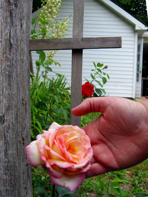

Meine "Peace"-Rose blüht! Ich hatte sie erst im März eingepflanzt und gar keine Blume erwartet, aber seit einer Woche hatte sie schon an einer dicke Knospe gearbeitet, die nun endlich aufgebrochen und zu dieser riesige Rose wurde.

Nach drei Tagen hab ich sie abgeschnitten und in eine Vase gestellt. Mal sehen ob sie das zu einer neuen Blüte antreibt.

Sie steht jetzt auf meinem Schreibtisch und ich kann nicht aufhören an ihr herumzuschnuppern. Hmmmm!
