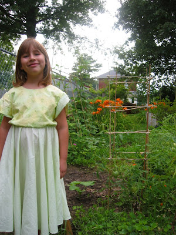
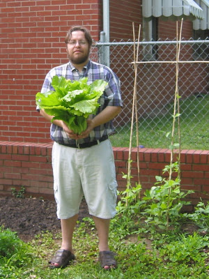
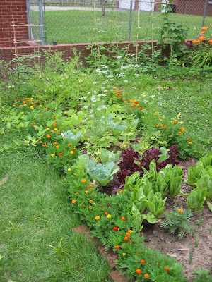
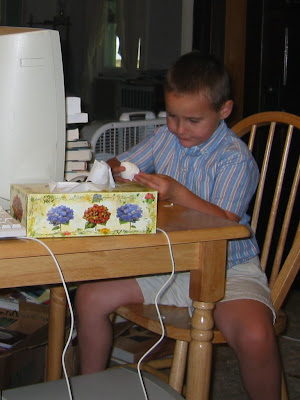

Hier steht Kirin neben meinem aus Bambus gebasteltem Tomatenkäfig. Die amerikanische Variante wird hier "Cane" (Rohrstock genannt) ist aber Bambus sehr ähnlich. Ich wollte dieses Jahr nicht mehr diese hässlichen Metallkäfige verwenden, sondern etwas aus ansprechendem und zugleich preiswertem Material herstellen. Cane wächst hier in feuchten Gebieten und ich fand ein gutes Dutzend gerade gewachsene, sechs Meter hohe Exemplare in Dan's Wald beim Little Grand Pierre Creek. Nach einigen Knotenversuchen und etwa 2 Stunden war das Kunstwerk vollbracht. Was denkt ihr davon?

Ich habe zuerst die "Better Boys" angebunden. Diese Fleischtomaten werden sehr groß und würden sonst auf dem Boden liegen. Die Romatomaten gleich daneben hatte ich zur gleichen Zeit ausgesaeht als ich die Fleischtomaten einpflanzte (zwei 10 cm hohe Pflanzen aus dem Laden). Sie haben ihre Kollegen schnell überholt und haben etwa ein Woche später Früchte angesetzt. Ich glaube nicht, das ich jemals wieder Tomatenpflanzen kaufen werde. Für $0.99 habe ich ein ganzes Beet voll mit Tomaten und musste sogar viele wegen Platzgründen auf den Kompost werfen.

Bei den Bohnen und Kohlköpfen war das etwas anders. Ich hatte noch Samen aus Mesa und Jeddito übrig, die ich beinahe wegwarf, mich aber am Ende für einen Samentest entschied. Die meisten Samen gingen wie erwartet nicht auf, aber die Bohnen, der Kohl und der Koriander sprießen alle fleißig aus meinem Papiertuch. Wie das so mit neuen Gärtnern ist, konnte ich mich nicht überwinden sie wegzuschmeißen, obwohl es erst Februar war. Also habe ich sie bis zum Mai in kleinen Plastebechern bevatert und sobald das Beet fertig war ausgesät. Viele haben aber in der großen Gartenwelt nicht überlebt und die ausgesäten Brüder und Schwestern haben sie bald ausgelacht. Bis auf einen Chinakohl! Der wuchs und wuchs und wurde vorgestern geschlachtet und ist zusammen mit dem Huhn im Wok gelanden. Hmmm.

Hier nochmal mein kleines Beet am 1. Juli.

Der Koriander blüht in der Mitte. Ich glaube ich hätte ein paar besser bescheiden sollen, denn die Blätter, die in vielen mexikanischen Gerichten verwendet werden, sind nun gelb geworden. Die Radieschen sind alle geerntet und ich habe dort nun Schalotten und Knoblauch angepflanzt.

Die Melonen rennen links und rechts aus dem Beet raus und er Salat ist schon wieder viel zu bitter. Wie oft muss man den denn schneiden??

Kai lässt sich heutzutage nicht mehr so einfach ablichten und ich musste mich anschleichen als er gerade beschäftigt war.
