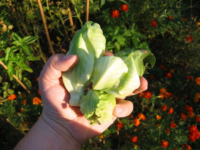
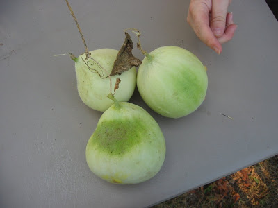
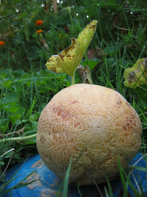

Hier nun die lang erwartete Herbsternte...

Babygemüse!

OK, das ist natürlich nicht alles. Die Tomaten trugen gut, haufenweise grüne Bohnen, vier Büschel Basilikum, die ich gerade trockne und ein paar Römersalate. Fast alle Melonen- und Kürbispflanzen sind zu früh gestorben, und ihre Früchte sind nicht ganz ausgereift:

Ich glaube die brauchen mehr Wasser. Den Babykürbis zeige ich euch später zu Halloween. Eine Zuckermelone hat es aber trotzdem geschafft:

Die roch und sah sehr lecker aus, schmeckte aber nur so lala... Hmmm, da muss ich mich mal umhören, wie die Melonenbauern die so süss hinbekommen.
