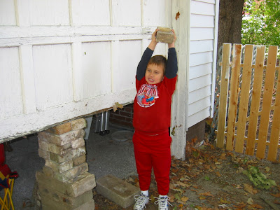
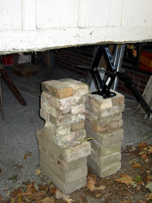
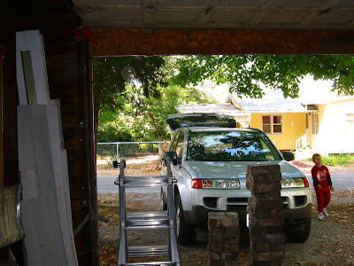

Zuerst braucht man einen starken Sklaven.

Eigene Kinder oder geldabhängige Jugendliche gehen auch. Neben genügend Ziegel- oder Betonsteinen, wird noch ein starker und langer Hebel benötigt.

Der erste Zentimeter ist der schwerste. Entweder die Garagentür ein wenig per Hand hochhieven oder ein Brecheisen unterschieben. Dann ein Ziegelstein unter die durch Hebelkraft leicht angehobene Garagentür schieben und so abwechselnd eine kleine Säule unter der Garagentür aufbauen.

Wenn Hebel zu kurz oder das Heben zu schwer wird, kann man einen Autoheber verwenden. Dieser ermöglicht auch das unterlegen von mehr als einem Ziegelstein.

Hier ist der Hebeprozess mit zwei Ziegelsäulen:

1.  Tür rechts mit Heber anheben

2.  linke Säule aufstapeln

3.  Tür vorsichtig auf linke Säule absetzten (Heber leicht runterdrehen) und Heber entfernen

4.  rechte Säule aufstapeln (oben Platz für Heber lassen)

5.  Heber in Lücke zwischen rechter Säule und Garagentür einfügen

6.  Weiter mit Schritt 1, bis Garagentür zu drei Viertel geöffnet ist

7.  Tür kann nun per Hand komplett geöffnet werden

8.  Türschienen blocken um die Tür offen zu halten

TADA!

