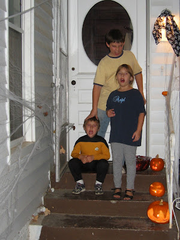

Dieses Jahr fand [Halloween](http://de.wikipedia.org/wiki/Halloween) einen Tag früher statt, weil, nach Angaben des Lokalblattes, "viele" Stadteinwohner am Mittwochabend, dem eigentlichen Halloween in diesem Jahr, zum Gottesdienst gehen. Somit wurde von jemand (keine Ahnung wer) beschlossen Trick-or-Treat am Dienstag, also dem 30. Oktober, stattfinden zu lassen. Und was, wenn man die Lokalzeitung nicht abonniert hat? Das werden wir sicher heute Abend sehen, wenn die zweite Welle nach Süßigkeiten verlangender Kinder an unsere Haustür klopft...

Ich habe unsere Kinder schon dazu angestiftet heute nochmal zu gehen. Ist ja schließlich Halloween im Rest des Landes! ;-)

Auf dem Photo kann man sehen, wie Paul seine dämonischen Einfluß mittels Handauflegen auf unsere Kinder überträgt. Die üblichen Symptome wie rot leuchtende Pupillen, verzerrte Gesichtszüge und einen unersättlichen Hunger auf Zucker und Erdnüsse hielten bis Mitternacht an, als der Schlaf sie endlich übermächtigte. Am nächsten Morgen war der Spuck vorbei, bis zum nächsten Jahr...
