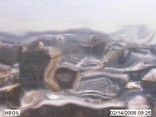
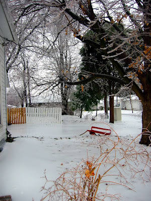
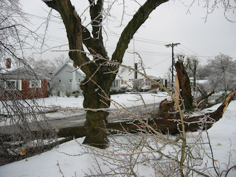

Nein ihr seht nicht doppelt, das ist die gleiche Webcam wie oben, aber total mit Eis überzogen. Genau so wie alles andere in Harrisburg vereist war.

Auf dem Bild unten kann man sehen wie der Zaun sich im Eis reflektiert. Erst gab es Hagel, dann Schnee, dann Regen der sich in der Nacht zum Eisregen entwickelte, wodurch alles mit einer 2 Zentimeter dicken Eisschicht überzogen wurde.

Um 4 Uhr nachts hörte ich dann ein Krachen und Blitzen, dann war wieder Stille. Morgens stellte sich heraus, das unser Ahornbaum (der gleiche der [im Sommer einen seiner Hauptäste verlor](/de/blog/2007-09-14-storm-damage/)) durch das Gewicht des Eises komplett den Geist aufgab und dabei die Stromleitung auf der gegenüberliegenden Straßenseite mitnahm.

Die Stromleute mussten den Strommast auswechseln und es dauert bis 8 Uhr abends, bis wir (und der Rest des Stadtblocks) wieder Strom hatten. Leute außerhalb der Stadt hatten es nicht so leicht. Die mussten bis zu 3 Tage lang warten.
