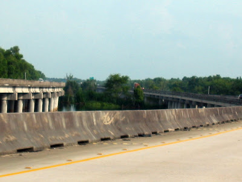
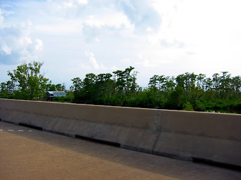
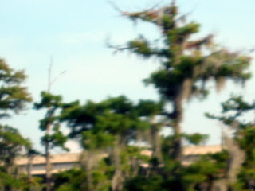

Immer noch auf dem Weg nach New Orleans sind wir auf einmal [im Sumpf](http://maps.google.com/maps?f=q&hl=en&geocode=&q=New+Orleans,+LA&ie=UTF8&ll=30.056339,-90.373597&spn=0.000789,0.001207&t=h&z=20).

Wir fahren Kilometer für Kilometer auf massiven Betonsäulen hoch über den Bayous (langsam fließende Flußarme) und zeigen mit den Fingern aufgeregt auf das "Spanische Moos", wie es die Einheimischen nennen. In deutsch heißt das wohl "Luisianamoos". Hmm, passend.

Update: Mutti fragte nach einem Photo vom Louisianamoos. Leider haben wir nur ein verschwommenes von der Hinfahrt.
