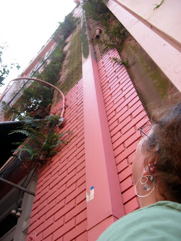

Die Luftfeuchte in New Orleans ist hoch genug, daß Moos und Farne in den Ritzen der Außenwände wachsen. Erst dachte ich das das ein lokaler Gärtnerbrauch ist um alte Mauern zu verschönern, aber diese Farne sind oft zwei oder drei Stockwerke hoch in der Mitte einer kahlen Wand. Das sind entweder sehr mutige Gärtner oder der Wind.

Hier wachsen sowieso viele Pflanzen, die wir kalten Deutschen nur als Zimmerpflanze kennen, einfach auf der Straße rum. Die Tomaten wachsen hier bestimmt das ganze Jahr über?

